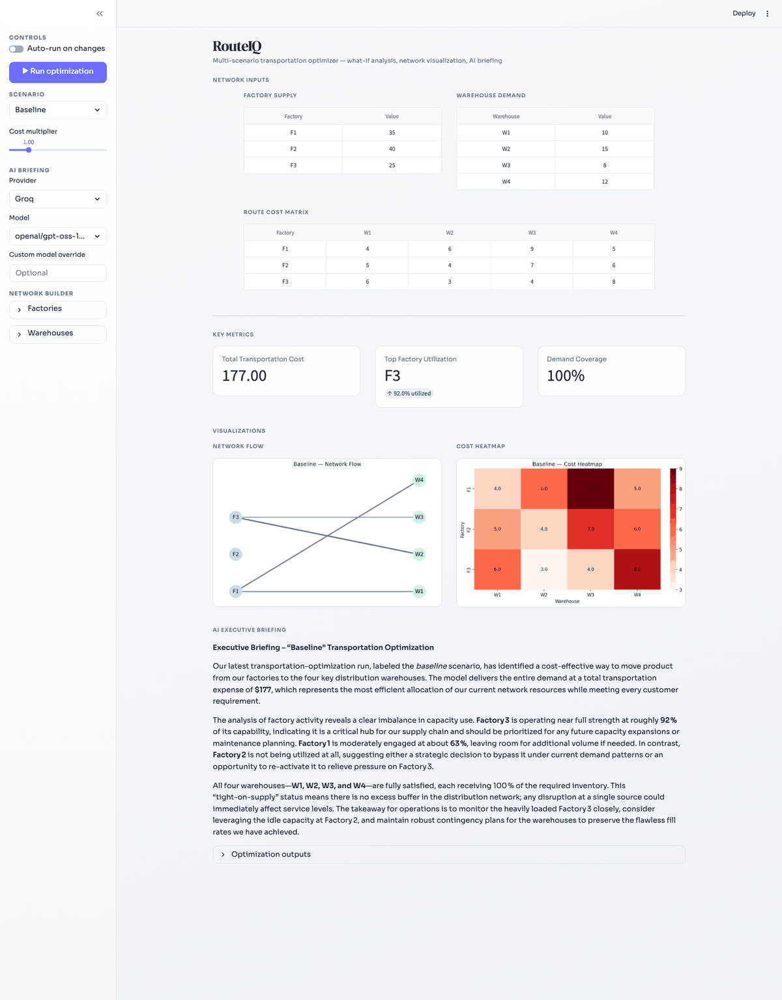
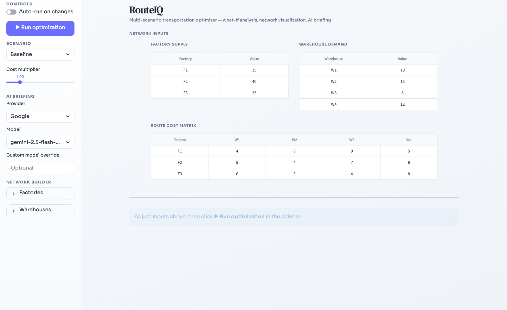
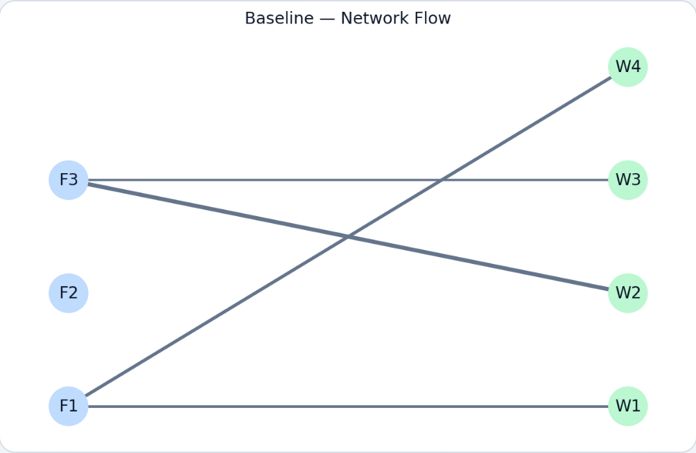
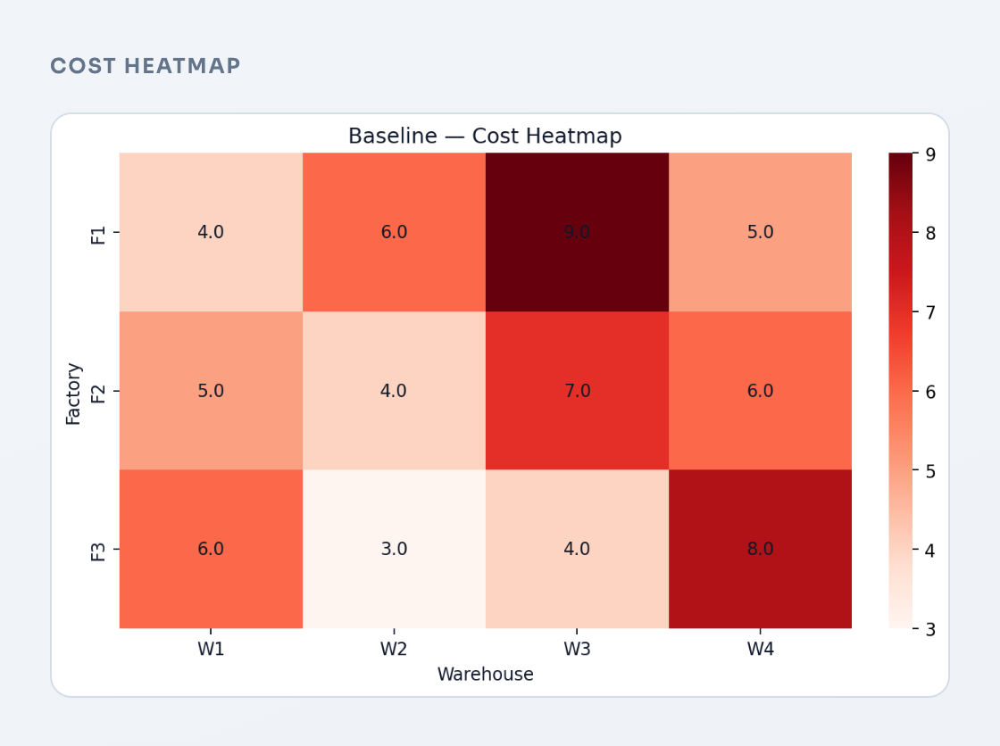
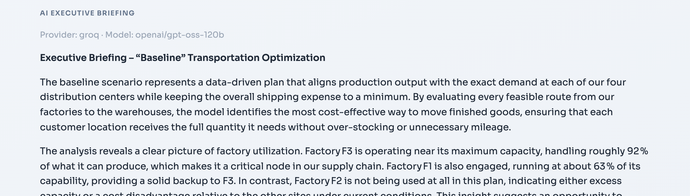

# RouteIQ: Transportation Optimizer + AI Explainer



> Multi-scenario transportation optimizer with AI executive briefing

RouteIQ is an interactive Streamlit app for transportation-network optimization.
It solves a classic supply-to-demand allocation problem with linear programming,
compares multiple scenarios, and generates an executive AI briefing.

## Problem Statement

Given:
- Multiple factories with fixed supply.
- Multiple warehouses with required demand.
- Route-level transportation costs.

Goal:
- Ship units from factories to warehouses to satisfy demand at minimum total cost.

## Features

- PuLP optimization model with supply and demand constraints.
- Scenario analysis in one dataset: `baseline`, `disruption`, `cost_surge`.
- Visualization layer:
  - Network flow chart.
  - Cost heatmap.
- AI executive briefing generated from optimization outputs.
- Streamlit interface:
  - Scenario selector.
  - Cost multiplier slider for what-if analysis.
  - AI provider and model selector for briefing generation.
  - Live metrics, charts, and briefing in one dashboard.

## Project Structure

```text
RouteIQ/
├── README.md
├── app.py
├── .env.example
├── assets/
│   └── README.md
├── data/
│   └── scenarios.csv
├── scripts/
│   └── switch_provider.sh
└── src/
    ├── ai_explainer.py
    ├── optimizer.py
    ├── scenarios.py
    └── visualizations.py
```

## Tech Stack

- Python 3
- Streamlit
- PuLP
- pandas
- matplotlib / seaborn / networkx
- openai + python-dotenv

## Run Locally

### 1. Setup

```bash
git clone https://github.com/sauravsz/RouteIQ.git
cd RouteIQ
python3 -m venv .venv
source .venv/bin/activate
pip install pulp pandas matplotlib seaborn networkx streamlit openai python-dotenv
```

### 2. Configure AI Provider

```bash
cp .env.example .env
```

In `.env`:
- Set `AI_PROVIDER` to one of: `openai`, `groq`, `cerebras`, `google`.
- Fill the matching API key variable.

Quick provider switch command:

```bash
./scripts/switch_provider.sh google
```

### 3. Run App

```bash
streamlit run app.py
```

Inside the app sidebar:
- Choose scenario and cost multiplier.
- Choose AI provider and AI model used for the executive briefing.
- Optionally enter a custom model name.

## App Screenshots

### Key Metrics (Baseline Scenario)


### Optimized Network Flow


### Route Cost Heatmap


### AI-Generated Executive Briefing


## Notes

- Secret safety is enforced by `.githooks/pre-commit` when enabled with:

```bash
git config core.hooksPath .githooks
```

- If the solver reports infeasible, verify total supply is at least total demand for the selected scenario.

## ❓ Frequently Asked Questions

**Q: Can I use my own supply/demand data?**  
A: Yes! Simply update `data/scenarios.csv` with your own factories, warehouses, and route costs. The PuLP optimizer dynamically scales to the size of the dataset.

**Q: Which AI provider is best for the executive briefing?**  
A: The app supports OpenAI, Groq, Cerebras, and Google (Gemini). For the fastest generation, Groq is recommended. For complex analysis, OpenAI (GPT-4o) or Google (Gemini 1.5 Pro) provides deeper insights.

**Q: What happens if demand exceeds supply?**  
A: The linear programming model requires total supply to be greater than or equal to total demand for a feasible solution. If demand exceeds supply, the solver will report an "Infeasible" status.

## Status

Phases 1 to 7 are complete.

## Author

Saurav
