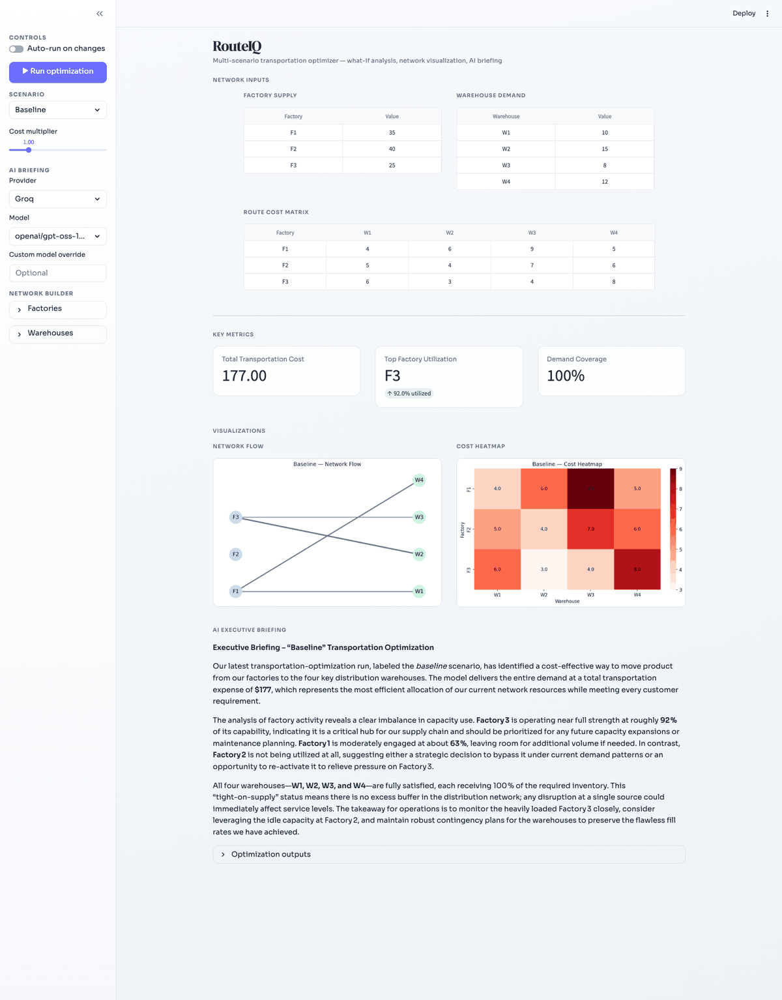

# RouteIQ: Transportation Optimizer + AI Explainer



> Multi-scenario transportation optimizer with AI executive briefing & cost matrix image extraction.

RouteIQ is an interactive Streamlit app for transportation-network optimization.
It solves classic supply-to-demand allocation problems using linear programming (PuLP),
supports custom image uploads for automatic matrix extraction via Gemini 3.5 Flash,
and generates non-technical AI executive briefings.

## Problem Statement

Given:
- Multiple factories with fixed supply capacities.
- Multiple warehouses with required demand volumes.
- Route-level shipping costs per unit.

Goal:
- Determine optimal shipping flows from factories to warehouses to satisfy demand at minimum total cost.

## Key Features

- **Unified Cost Matrix Grid**: Edit costs, factory supplies, and warehouse demands in a single unified table (`st.data_editor`).
- **Dynamic Network Scaling**: Add or remove factories (rows) and warehouses (columns) directly from the interface.
- **AI Image Extraction**: Upload a photo of a cost matrix table — extracted automatically via Google Gemini 3.5 Flash vision into RouteIQ's solver.
- **LP & Fixed-Charge MIP Solvers**: Solve standard transportation LPs or MIPs with fixed lane costs using CBC / GLPK.
- **AI Executive Briefing**: Multi-provider LLM integration (Google, OpenAI, Groq, Cerebras) to generate C-suite executive summaries.
- **Interactive Visualizations**: Network flow diagrams and cost heatmaps powered by Plotly and Matplotlib.
- **Report Exports**: One-click download of PDF executive briefings and raw Excel datasets.

## Project Structure

```text
RouteIQ/
├── README.md
├── app.py                     # Streamlit app (UI, matrix state, data editor)
├── config.yaml                # App configuration
├── .env.example               # Environment variables template
├── data/
│   └── scenarios.csv          # Pre-loaded scenarios (baseline, disruption, cost_surge)
├── src/
│   ├── ai_explainer.py        # Executive briefing + Gemini 3.5 Flash vision extraction
│   ├── features.py            # PDF and Excel report generation
│   ├── optimizer.py           # PuLP transportation LP / MIP solver engine
│   ├── scenarios.py          # Dataset & custom scenario loader
│   └── visualizations.py      # Plotly & Matplotlib chart builders
└── tests/
    ├── test_features.py       # PDF/Excel report unit tests
    ├── test_matrix.py         # Unified matrix state & parser unit tests
    └── test_optimizer.py      # PuLP solver unit tests
```

## Tech Stack

- **Python 3.9+**
- **Streamlit** — Web dashboard & data editor
- **PuLP** — Linear & Mixed-Integer Programming solver
- **Google Gemini 3.5 Flash** — Vision extraction for cost matrix images
- **OpenAI API Client** — Multi-provider LLM briefing generation
- **Plotly & Matplotlib** — Interactive visualization layer
- **ReportLab & OpenPyXL** — PDF and Excel export generation

## Quickstart

```bash
# Clone the repository
git clone https://github.com/sauravsz/RouteIQ.git
cd RouteIQ

# Install dependencies
pip install -r requirements.txt

# Set up environment variables
cp .env.example .env
# Add your GOOGLE_API_KEY to .env

# Run the app
streamlit run app.py
```
